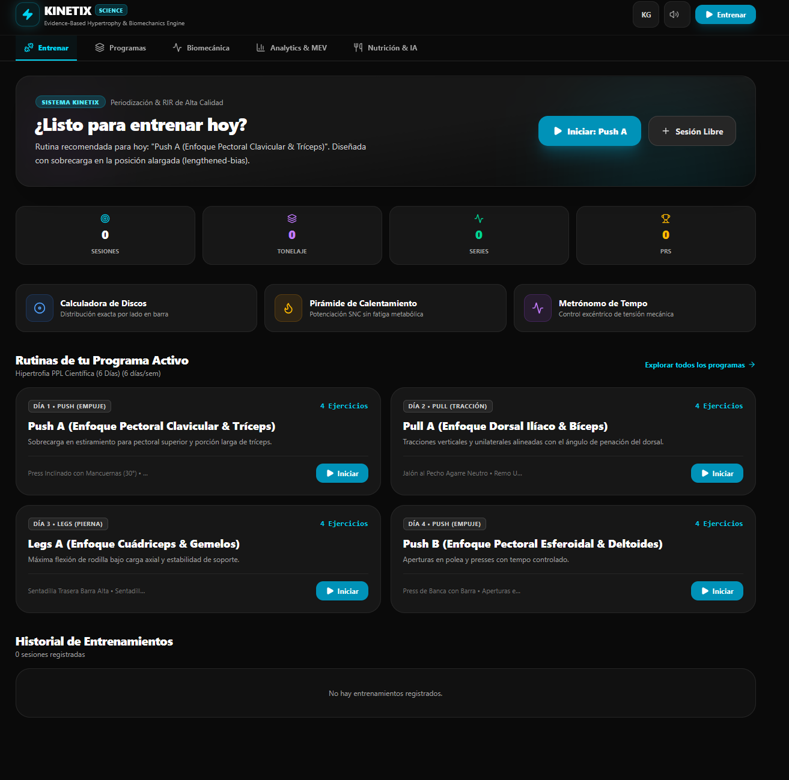
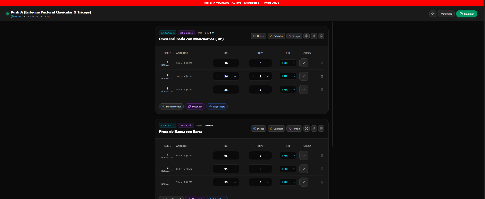
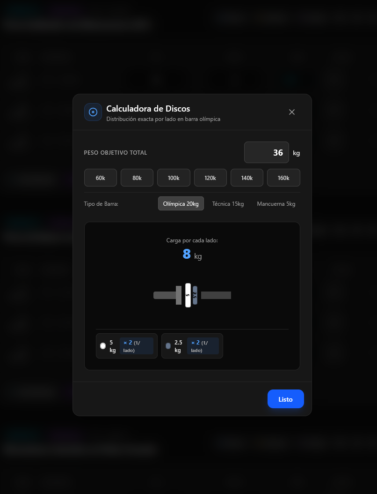
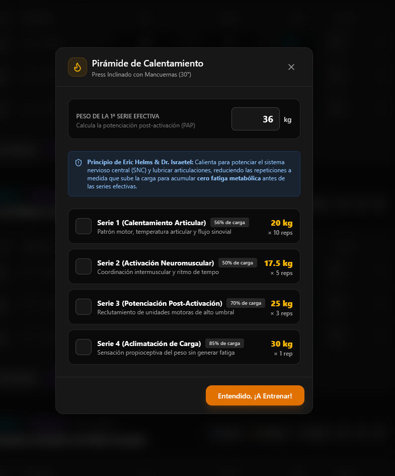
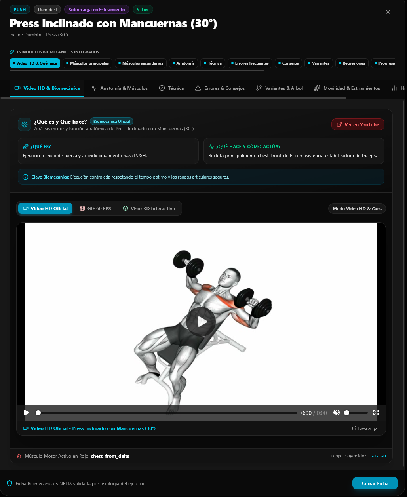
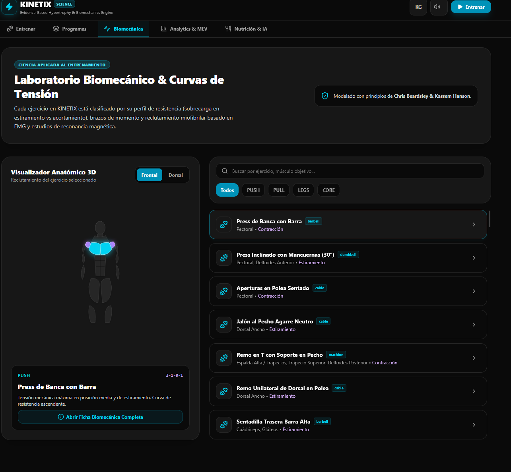
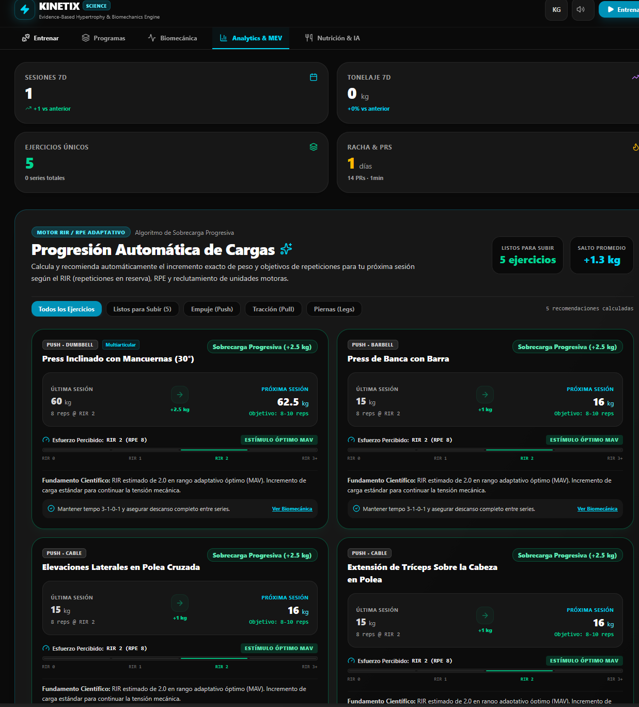

# ⚡ KINETIX — Science-Based Hypertrophy & Strength Engine

Entrenamiento de hipertrofia y fuerza basado en evidencia científica, con analytics avanzados de volumen (MEV/MAV/MRV), calculadora de 1RM, programa de nutrición y soporte PWA/mobile. **Sin APIs externas, sin claves, 100% offline en tu dispositivo.**

## 📱 Screenshots

| | | |
|:---:|:---:|:---:|
|  |  |  |
| **Inicio & Entrenar** | **Programas** | **Biomecánica** |
|  |  |  |
| **Analytics & MEV** | **Nutrición** | **Logger en vivo** |
|  | | |
| **Detalle de ejercicio** | | |

---

## 🚀 Live Demo

[](https://vercel.com/new/clone?repository-url=https://github.com/Fernandezalejo1/kinetix)

Desplegada en: **https://kinetix-science-based-hypertrophy-a.vercel.app/**

> 🔒 **PIN de acceso:** la app está protegida con el PIN `2113` (fijo, en cualquier dispositivo).

## ✨ Features

- ✅ **Acceso con PIN** fijo para proteger la app
- ✅ **Programas de entrenamiento** con progresión automática
- ✅ **Workout logger** con timer de descanso y tracking de RIR/RPE
- ✅ **Analytics** de volumen (MEV, MAV, MRV) y progreso de fuerza
- ✅ **Calculadora de 1RM** con múltiples fórmulas (Brzycki, Epley, Wathan)
- ✅ **Calculadora de placas**, metrónomo de tempo y generador de calentamiento
- ✅ **Nutrición** con objetivos calculados según tu peso corporal, reseteo diario y tracking de macros
- ✅ **Biomecánica** con base de datos de ejercicios, anatomía, errores frecuentes y variaciones
- ✅ **PWA instalable** con service worker y soporte offline
- ✅ **Mobile-first** con navegación por pestañas y safe areas
- ✅ **Dark theme** optimizado para AMOLED

## 🏗️ Arquitectura

```
src/
├── components/
│   ├── workout/        # WorkoutHub, LiveWorkoutLogger, PlateCalculator, TempoMetronome, WarmupGenerator
│   ├── exercises/      # BiomechanicsHub, ExerciseDetail, Library, AnatomyVisualizer
│   ├── programs/       # ProgramsExplorer, RoutineEditor
│   ├── analytics/      # ScienceDashboard (MEV/MAV/MRV, PRs, progress)
│   ├── nutrition/      # NutritionVisionHub (macros, comidas, objetivos)
│   └── Navigation.tsx  # Bottom/header navigation
├── context/            # WorkoutContext (estado global + localStorage)
├── data/               # exercisesData, programsData
├── utils/              # scienceCalculators, exerciseEnhancer
├── types.ts
├── App.tsx             # Root con lazy loading
└── main.tsx            # Entry con ErrorBoundary + PWA
```

## 🧰 Tech Stack

- **Frontend:** React 19, TypeScript, Tailwind CSS 4
- **Build:** Vite 6, esbuild
- **Charts:** Recharts
- **Icons:** Lucide React
- **Animations:** Motion (Framer Motion)
- **Mobile:** Capacitor 8 (Android)
- **Deploy:** Vercel (PWA estática, sin backend)

## 📦 Scripts

| Script | Descripción |
|--------|-------------|
| `npm run dev` | Servidor de desarrollo con HMR |
| `npm run build` | Build de producción (Vercel) |
| `npm run build:capacitor` | Build + server para Android |
| `npm run start` | Ejecutar el servidor de producción (self-host) |
| `npm run preview` | Previsualizar el build localmente |
| `npm run typecheck` | Verificar tipos TypeScript |

## 🚀 Deploy a Vercel

```bash
npm i -g vercel
vercel
vercel --prod
```

> La app es estática: no requiere variables de entorno ni servicios externos.

## 📱 Build Android (Capacitor)

```bash
npm run build:capacitor
npx cap sync android
npx cap open android
```

## 🛠️ Desarrollo Local

```bash
npm install
npm run dev
```

## 📄 Licencia

MIT © KINETIX
